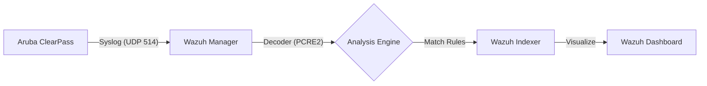
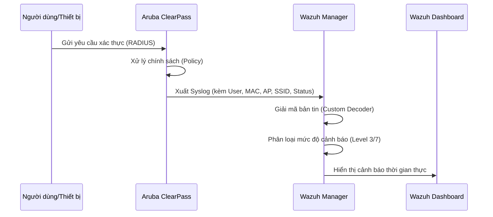

# 🛡️ Wazuh Integration for Aruba ClearPass (CPPM)


[](https://wazuh.com/)
[](https://www.arubanetworks.com/products/security/network-access-control/)
[](https://opensource.org/licenses/MIT)

Dự án này cung cấp một giải pháp tích hợp toàn diện để thu thập, giải mã và phân tích các sự kiện xác thực từ **Aruba ClearPass Policy Manager (CPPM)** trên nền tảng **Wazuh SIEM**. 

---

## 📊 Kiến trúc hệ thống (System Architecture)

### Luồng dữ liệu tổng quát


### Quy trình xử lý sự kiện (Sequence Diagram)


---

## 📂 Cấu trúc dự án (Project Structure)

```text
.
├── config/
│   └── wazuh_cluster/
│       ├── custom_decoders/
│       │   └── clearpass_decoder.xml   # Bộ giải mã log PCRE2
│       ├── custom_rules/
│       │   └── clearpass_rules.xml     # Tập luật phân loại cảnh báo
│       └── ossec.conf                  # Cấu hình chính (đã bật Syslog)
├── images/
│   └── banner.png                      # Ảnh đại diện dự án
├── docker-compose.yml                  # Cấu hình triển khai Docker
├── .gitignore                          # Cấu hình loại trừ Git
└── README.md                           # Hướng dẫn sử dụng
```

---

## 🛠️ 1. Yêu cầu chuẩn bị (Prerequisites)

> [!IMPORTANT]
> Đảm bảo máy chủ của bạn có tối thiểu **8GB RAM** để vận hành ổn định cụm Indexer và Dashboard.

### Phần mềm
*   **Docker Engine** v20.10+
*   **Docker Compose** v2.0+

---

## ⚙️ 2. Cấu hình phía Aruba ClearPass

Để tích hợp thành công, bạn cần thiết lập ClearPass gửi log về Wazuh Manager:

1.  **Tạo Syslog Target**:
    *   Vào `Administration > External Servers > Syslog Targets`.
    *   **Server**: Địa chỉ IP của máy chủ Wazuh.
    *   **Protocol**: UDP (Cổng mặc định 514).
2.  **Cấu hình Export Filter**:
    *   Vào `Administration > External Servers > Dictionary > Export Filters`.
    *   Chọn (hoặc tạo) filter liên quan đến `RADIUS Authentication`.
    *   **Prefix**: Đảm bảo có chuỗi ký tự nhận diện đồng nhất (Ví dụ: `CLEARPASS_AUTH_LOGS`).

---

## 🚀 3. Triển khai nhanh (Quick Start)

### Bước 1: Tải mã nguồn
```bash
git clone https://github.com/tobinguyen-11/wazuh-aruba-clearpass.git
cd wazuh-aruba-clearpass
```

### Bước 2: Tùy chỉnh nhận diện
Mở file `config/wazuh_cluster/custom_decoders/clearpass_decoder.xml` và cập nhật từ khóa nhận diện khớp với cấu hình ở Bước 2:
```xml
<prematch>CLEARPASS_AUTH_LOGS</prematch>
```

### Bước 3: Khởi động hệ thống
```bash
docker-compose up -d
```

---

## 🔍 4. Logic bóc tách & Cảnh báo (Analysis Logic)

### Các trường dữ liệu hỗ trợ:
| Trường (Field) | Mô tả | Ví dụ dữ liệu |
| :--- | :--- | :--- |
| `user` | Tên tài khoản xác thực | `nguyenvana` |
| `srcmac` | Địa chỉ MAC thiết bị | `AA:BB:CC:11:22:33` |
| `ssid` | Tên mạng Wi-Fi | `Staff_WIFI` |
| `ap_name` | Tên Access Point | `AP-01-Floor2` |
| `error_code` | Mã lỗi (0 = Success) | `0` hoặc `216` |

### Phân loại mức độ cảnh báo (Alert Levels):
| Trạng thái | Level | Ý nghĩa | Điều kiện |
| :--- | :--- | :--- | :--- |
| **Thành công** | **3** | Ghi nhận hoạt động đăng nhập thông thường. | `error_code == 0` |
| **Thất bại** | **7** | Cảnh báo cần chú ý, dấu hiệu tấn công hoặc lỗi. | `error_code != 0` |

---

## 🛡️ 5. Kiểm tra & Xử lý sự cố

**Xem log thô đi vào (Raw Data):**
```bash
docker exec -it wazuh.manager tcpdump -i any udp port 514 -A
```

**Kiểm tra tính đúng đắn của Rule:**
```bash
docker exec -it wazuh.manager /var/ossec/bin/wazuh-control restart
```

---

## 📝 Bản quyền & Đóng góp
*   **Tác giả**: [Phat, Nguyen Trong (Tobi)]
*   **Email**: ntphat674@gmail.com

---
*Dự án này được xây dựng nhằm mục đích nâng cao năng lực giám sát an ninh mạng.*
